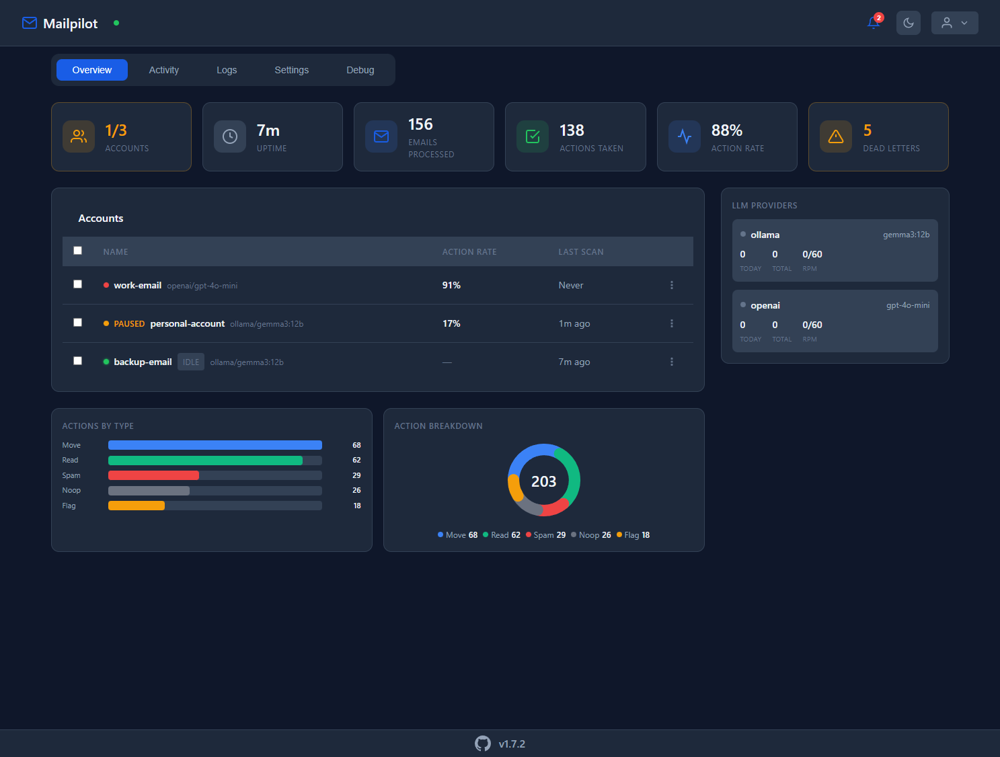

# Mailpilot

[](https://github.com/metal0/mailpilot/actions/workflows/test.yml)
[](https://github.com/metal0/mailpilot/actions/workflows/release.yml)
[](https://www.gnu.org/licenses/agpl-3.0)
[](https://matrix.to/#/#mailpilot:i0.tf)

AI-powered email processing daemon that uses LLM classification to automatically organize, flag, and manage your inbox.

<p align="center">
  
</p>

## Features

- **IMAP Support** - Connects to any IMAP server with IDLE push notifications
- **LLM Classification** - Uses OpenAI-compatible APIs to classify emails
- **Confidence Scoring** - Optional confidence thresholds to route low-confidence results to manual review
- **Multiple Actions** - Move to folders, mark as spam, flag, mark read, delete
- **Multi-Account** - Process multiple email accounts with per-account configuration
- **Rate Limiting** - Per-provider rate limiting with automatic 429 handling
- **Web Dashboard** - Modern Svelte SPA with real-time WebSocket updates and keyboard shortcuts
- **Attachment Extraction** - Extract text from PDF, DOCX, Excel via Apache Tika
- **Multimodal Vision** - Send images to vision-capable LLMs for analysis
- **Antivirus Scanning** - Optional ClamAV integration for malware detection
- **Webhooks** - Configurable webhooks for events like errors and actions
- **Graceful Shutdown** - Waits for in-flight operations to complete before exiting

## Quick Start

```bash
# Clone and install
git clone https://github.com/metal0/mailpilot.git
cd mailpilot
pnpm install

# Configure
cp config.example.yaml config.yaml
# Edit config.yaml with your settings

# Build and run
pnpm build
pnpm start
```

### Minimal Configuration

```yaml
llm_providers:
  - name: openai
    api_url: https://api.openai.com/v1/chat/completions
    api_key: ${OPENAI_API_KEY}
    default_model: gpt-4o-mini

accounts:
  - name: personal
    imap:
      host: imap.gmail.com
      username: ${GMAIL_USER}
      password: ${GMAIL_APP_PASSWORD}
```

Set environment variables:
```bash
export OPENAI_API_KEY="sk-..."
export GMAIL_USER="you@gmail.com"
export GMAIL_APP_PASSWORD="xxxx xxxx xxxx xxxx"
```

## Documentation

Full documentation is available on the **[GitHub Wiki](https://github.com/metal0/mailpilot/wiki)**.

| Guide | Description |
|-------|-------------|
| [Installation](https://github.com/metal0/mailpilot/wiki/Installation) | Setup and requirements |
| [Quick Start](https://github.com/metal0/mailpilot/wiki/Quick-Start) | Get running in 5 minutes |
| [Configuration Reference](https://github.com/metal0/mailpilot/wiki/Configuration-Reference) | All configuration options |
| [Gmail Setup](https://github.com/metal0/mailpilot/wiki/Gmail-Setup) | Gmail with App Passwords |
| [Outlook Setup](https://github.com/metal0/mailpilot/wiki/Outlook-&-Microsoft-365) | Microsoft 365/Outlook |
| [LLM Providers](https://github.com/metal0/mailpilot/wiki/OpenAI-Setup) | OpenAI, Ollama, Claude, etc. |
| [Prompts Guide](https://github.com/metal0/mailpilot/wiki/Prompts-Guide) | Writing classification prompts |
| [Troubleshooting](https://github.com/metal0/mailpilot/wiki/Troubleshooting) | Common issues and solutions |

## Docker Deployment

### Basic

```yaml
services:
  mailpilot:
    image: ghcr.io/metal0/mailpilot:latest
    ports:
      - "8080:8080"
    volumes:
      - ./config.yaml:/app/config.yaml:ro
      - ./data:/app/data
    environment:
      - OPENAI_API_KEY=${OPENAI_API_KEY}
```

### Full (with Tika + ClamAV)

```bash
docker compose -f docker-compose.full.yaml up -d
```

Includes Apache Tika for attachment extraction and ClamAV for virus scanning.

## Development

```bash
pnpm dev          # Run with hot reload
pnpm test         # Run tests
pnpm lint         # Run ESLint
pnpm typecheck    # Type check
```

## Community

- **[Matrix Chat](https://matrix.to/#/#mailpilot:i0.tf)** - Join the community chat room
- **[GitHub Issues](https://github.com/metal0/mailpilot/issues)** - Report bugs or request features
- **[GitHub Wiki](https://github.com/metal0/mailpilot/wiki)** - Full documentation

## License

AGPL-3.0
