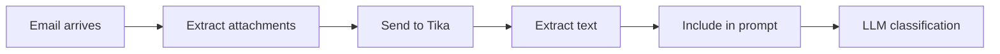
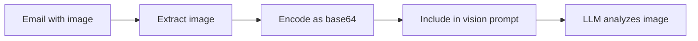

# Attachment Processing

Mailpilot can extract text content from email attachments and include it in the LLM classification context.

## Overview

When enabled, Mailpilot:

1. **Extracts text** from attachments using Apache Tika
2. **Includes content** in the prompt sent to the LLM
3. **Enables vision models** to analyze images (optional)

This allows the LLM to make classification decisions based on attachment content, not just email metadata.

## Supported File Types

### Documents

- **PDF**: `.pdf`
- **Microsoft Office**: `.doc`, `.docx`, `.xls`, `.xlsx`, `.ppt`, `.pptx`
- **Text files**: `.txt`, `.csv`, `.md`
- **OpenDocument**: `.odt`, `.ods`, `.odp`

### Images (Vision Models)

When `extract_images: true`:

- **PNG**: `.png`
- **JPEG**: `.jpg`, `.jpeg`
- **GIF**: `.gif`
- **WebP**: `.webp`

Images are sent to vision-capable models like GPT-4 Vision or Claude 3.

## How It Works

### Text Extraction



Tika extracts text from binary formats and returns plain text that's appended to the email body before classification.

### Vision Analysis

For vision-enabled models:



The LLM can "see" screenshots, charts, diagrams, and photos.

## Use Cases

### Invoice Processing

Extract invoice details from PDF attachments:

```yaml
attachments:
  enabled: true
  allowed_types:
    - application/pdf

accounts:
  - name: business
    folders:
      - name: INBOX
        prompt: |
          If email has PDF attachment containing an invoice:
          - Extract vendor name and amount
          - Move to "Invoices/{Vendor Name}"
          - Flag for review
```

### Receipt Organization

Classify emails with receipt images:

```yaml
attachments:
  enabled: true
  extract_images: true
  allowed_types:
    - application/pdf
    - image/png
    - image/jpeg

llm_providers:
  - name: openai-vision
    provider: openai
    model: gpt-4o
    supports_vision: true
```

### Document Analysis

Analyze contract or report contents:

```yaml
attachments:
  enabled: true
  max_extracted_chars: 50000  # Increase for long documents
  allowed_types:
    - application/pdf
    - application/vnd.openxmlformats-officedocument.wordprocessingml.document
```

### Screenshot Triage

Classify support emails with screenshots:

```yaml
attachments:
  enabled: true
  extract_images: true

accounts:
  - name: support
    folders:
      - name: INBOX
        llm_provider: claude-vision
        prompt: |
          Analyze screenshot attachments to categorize issues:
          - UI bugs: move to "Bugs/UI"
          - Backend errors: move to "Bugs/Backend"
          - Feature requests: move to "Features"
```

## Configuration

### Basic Setup

```yaml
attachments:
  enabled: true
  tika_url: http://localhost:9998
```

See the [Attachments Configuration](/docs/configuration/attachments) page for detailed setup instructions.

### Vision Models

```yaml
attachments:
  enabled: true
  extract_images: true  # Enable for vision models

llm_providers:
  - name: gpt4-vision
    provider: openai
    model: gpt-4o
    supports_vision: true
```

## Performance Considerations

### Resource Usage

- **Tika memory**: ~500MB baseline
- **Extraction time**: 50-500ms per document
- **Token usage**: Extracted text counts toward LLM context limits

### Size Limits

```yaml
attachments:
  max_size_mb: 10           # Max attachment size to process
  max_extracted_chars: 10000  # Limit extracted text length
```

**Recommendation**: Set `max_size_mb` based on your Tika server resources. Large PDFs can take several seconds to process.

### Selective Processing

Only process specific file types to reduce overhead:

```yaml
attachments:
  allowed_types:
    - application/pdf  # Only process PDFs
```

## Privacy & Security

### Local Processing

All attachment extraction happens locally:

- **No cloud uploads**: Attachments never leave your server
- **Tika runs locally**: Apache Tika processes files on your machine
- **LLM context**: Extracted text is sent to your configured LLM provider

### Malware Scanning

Combine with antivirus scanning for security:

```yaml
antivirus:
  enabled: true
  on_virus_detected: quarantine

attachments:
  enabled: true  # Only process clean attachments
```

Mailpilot scans attachments with ClamAV before extraction, ensuring malware is quarantined.

## Troubleshooting

### Tika Not Running

**Error**: `Failed to connect to Tika server`

**Fix**: Ensure Apache Tika is running:

```bash
curl http://localhost:9998/tika
# Should return "Apache Tika"
```

### Large Attachments Skipped

**Symptom**: Some attachments aren't processed

**Cause**: Exceeds `max_size_mb` limit

**Fix**: Check logs for "Attachment too large" messages and increase limit if needed

### Extraction Timeouts

**Symptom**: "Tika extraction timed out"

**Cause**: Complex documents take too long

**Fix**: Increase timeout:

```yaml
attachments:
  timeout: 60s  # Increase from default 30s
```

## Next Steps

- [Configure attachment processing →](/docs/configuration/attachments)
- [Set up antivirus scanning →](/docs/features/antivirus)
- [Write prompts for attachments →](/docs/configuration/prompts-guide)
